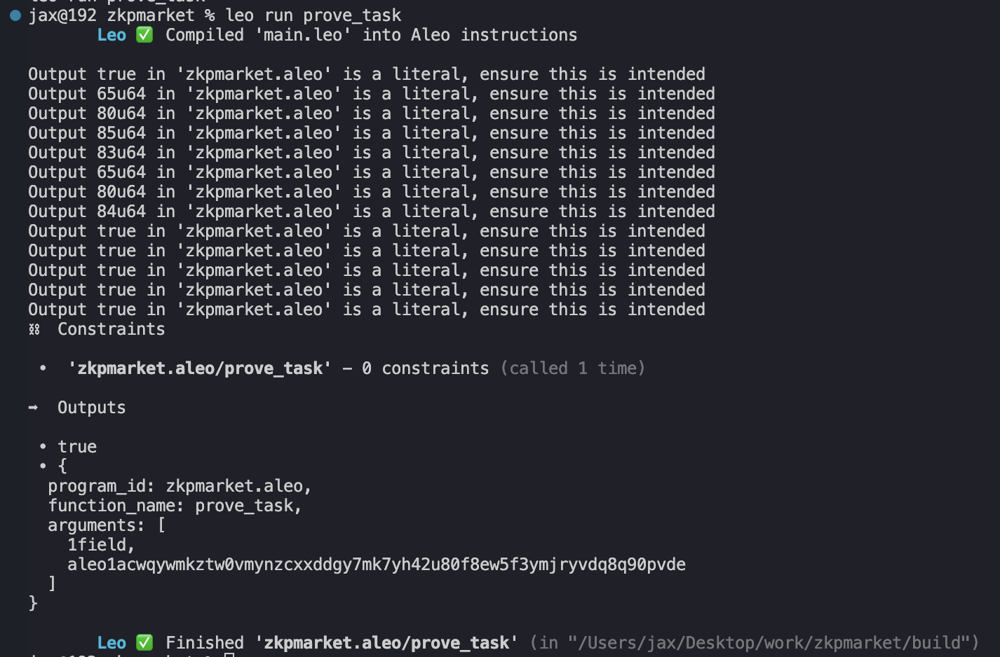

# zkpmarket.aleo

## Install Aleo

https://developer.aleo.org/leo/installation

## Build Guide

To compile this Aleo program, run:
```bash
leo build
```

To execute this Aleo program, run:
```bash
leo run main
```

## How to run code

example
`leo run prove_task`



